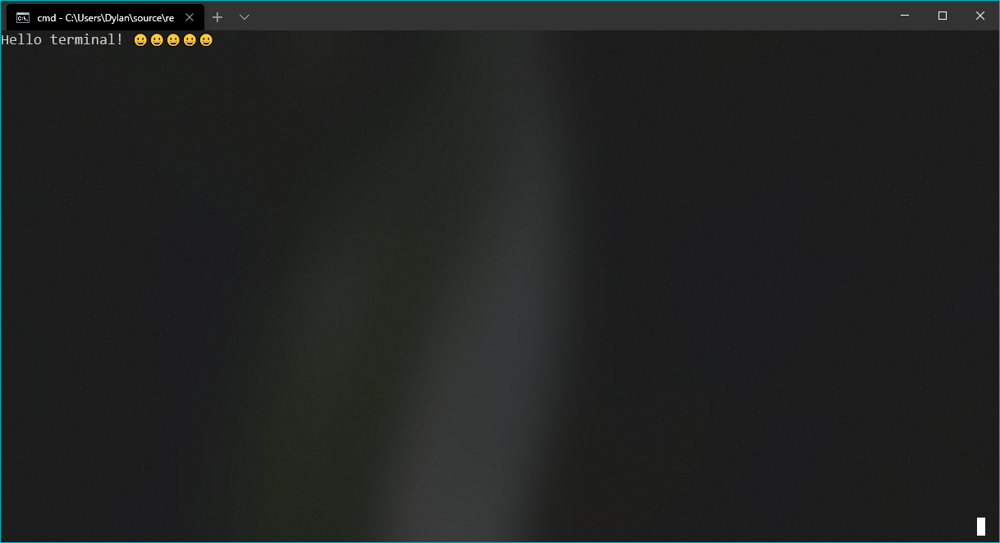

# TG
*Cross-platform terminal graphics library*

TG grants you advanced control over the terminal in a standard, cross-platform manner with wide character (UTF, emoji, etc) support baked in and not appended
as an afterthought.

Programs are double-buffered, like normal graphical programs are, to ensure
quick rendering. Writing pixels to the screen is an expensive operation, so
most graphics programs write to an off-screen buffer and then swap the
off-screen buffer with the on-screen one, to only do one screen update per
frame. TG works the same way.

TG is only as good as the terminal emulator it is run in. On Windows, the
Terminal Preview (Available in the store for download) is recommended, as
it can render emojis properly, whereas CMD.exe and powershell.exe support
UTF-8, but not emojis.

On Linux, there are hundreds of terminal emulators available. Many of them
work with UTF-8 and emojis.

TG is well-documented [here](docs/main.md)

Note: If you see "Version x.x.x" as a commit message, please read the changelog for that version